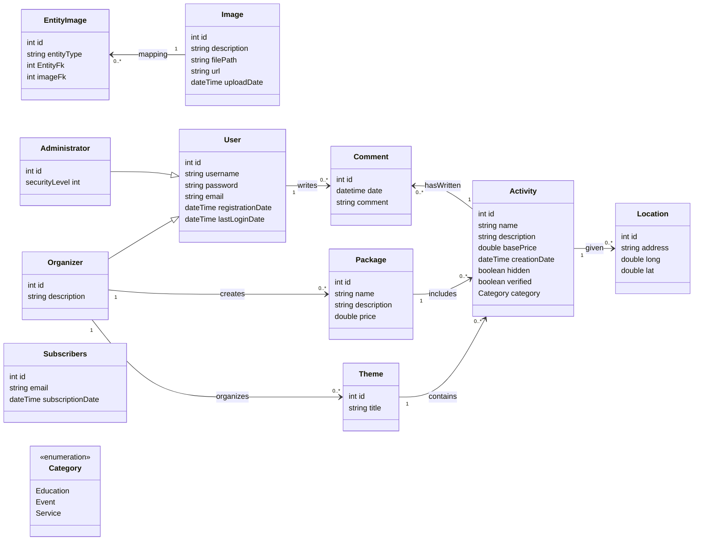

# T120B165-Web-Application-Design

## Edukacijų ir kitų paslaugų skelbimų sistema

### Uždavinio aprašymas
Skelbimų sistema skirta organizatoriams skelbti skelbimus apie edukacinius renginius.

Sistemos paskirtis
- Patekti informaciją apie vykstančius edukacinius renginius ir veiklas.
- Leisti svečiams peržiūrėti edukacinius renginius, aktyvuoti naujienlaiškio prenumeratą.
- Leisti renginių dalyviams rašyti atsiliepimus ir įvertinimus.
- Leisti organizatoriams pridėti skelbimus apie naujus renginius ir veiklas.

### Funkciniai reikalavimai

1. **Svečio funkcijos:**
    - Peržiūrėti temas
    - Peržiūrėti edukacijų skelbimus
    - Aktyvuoti naujienlaiškio prenumeratą
    - Registruotis kaip organizatoriui
2. **Organizatoriaus funkcijos:**
    - Sukurti temą
    - Paslėpti/Rodyti temą
    - Pašalinti temą
    - Sukurti skelbimą
    - Paslėpti/Rodyti skelbimą
    - Pašalinti skelbimą
3. **Administratoriaus funkcijos:**
    - Patvirtinti temą/skelbimą
    - Pašalinti paskyrą
    - Patvirtinti naują paskyrą

### Pasirinktų technologijų aprašymas:
1. Backend technologijos:
   - Programavimo kalba: Golang
   - Duomenų bazė: MariaDB
   - Autentifikacija: JWT

2. Frontend technologijos:
   - React.js

### Pagrindiniai objektai:

1. **Tema**
    - Pavadinimas
    - Aprašymas
2. **Veikla**
    - Pavadinimas
    - Aprašymas
    - Bazinė kaina
    - Vieta (gatvė, miestas, šalis arba koordinatės).
    - Bazinė kaina
    - Kontaktai
3. **Paketas**
    - Pavadinimas
    - Aprašymas
    - Kaina
    - Kontaktai

### Rolės:

- **Svečias**: gali ieškoti skelbimų, aktyvuoti naujienlaiškio prenumeratą.
- **Vartotojas**: gali palikti atsiliepimus ir įvertinimus apie skelbimus
- **Organizatorius**: gali skelbti skelbimus ir temas.
- **Administratorius**: turi visas valdymo funkcijas, įskaitant vartotojų administravimą, skelbimų ir temų priežiūrą.

### Klasių diagrama:

