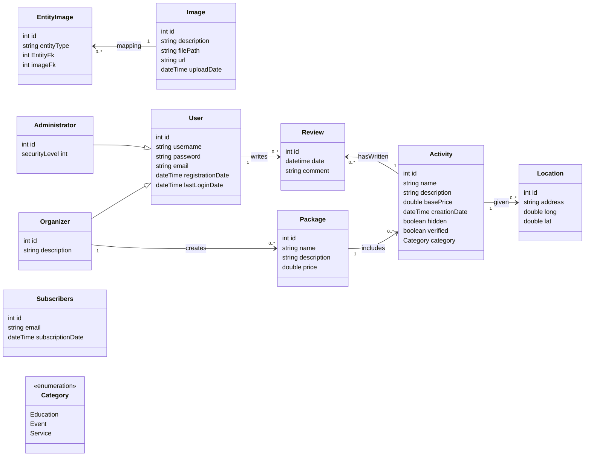

# T120B165-Web-Application-Design

## Edukacijų Pilis

### Uždavinio aprašymas
Edukaciju Pilis - skelbimų sistema skirta organizatoriams skelbti skelbimus apie edukacinius renginius ir kitas veiklas.

Sistemos paskirtis
- Patekti informaciją apie vykstančius edukacinius renginius ir veiklas.
- Leisti svečiams peržiūrėti edukacinius renginius, aktyvuoti naujienlaiškio prenumeratą.
- Leisti renginių dalyviams rašyti atsiliepimus ir įvertinimus.
- Leisti organizatoriams pridėti skelbimus apie naujus renginius ir veiklas.

### Funkciniai reikalavimai

1. **Svečio funkcijos:**
    - Peržiūrėti temas
    - Peržiūrėti veiklas
    - Peržiūrėti veiklų atsiliepimus
    - Aktyvuoti naujienlaiškio prenumeratą
    - Atsisakyti naujienlaiškio prenumeratos
    - Registruotis kaip vartotojui
2. **Organizatoriaus funkcijos:**
    - Sukurti temą
    - Paslėpti/Rodyti temą
    - Pašalinti temą
    - Sukurti skelbimą
    - Paslėpti/Rodyti skelbimą
    - Pašalinti skelbimą
3. **Administratoriaus funkcijos:**
    - Patvirtinti temą/skelbimą
    - Pašalinti paskyrą
    - Sukurti organizatoriaus paskyrą

### Pasirinktų technologijų aprašymas:
1. Backend technologijos:
   - Programavimo kalba: Golang
   - Duomenų bazė: MariaDB
   - Autentifikacija: JWT

2. Frontend technologijos:
   - React.js

### Pagrindiniai objektai:

1. **Tema**
    - Pavadinimas
    - Aprašymas
2. **Veikla**
    - Pavadinimas
    - Aprašymas
    - Bazinė kaina
    - Vieta (gatvė, miestas, šalis arba koordinatės).
    - Bazinė kaina
    - Kontaktai
3. **Paketas**
    - Pavadinimas
    - Aprašymas
    - Kaina
    - Kontaktai
3. **Atsiliepimas**
    - Data
    - Komentaras
    - Įvertinimas
### Hierarchiniai ryšiai
- Tema/Paketas -> Veikla: viena tema ar paketas gali tūrėti kelias organizuojamas veiklas.
- Veikla -> Atsiliepimas: viena veikla gali tūrėti kelis parašyus atsiliepimus.

### Rolės:
- **Svečias**: gali ieškoti skelbimų, aktyvuoti naujienlaiškio prenumeratą.
- **Vartotojas**: gali palikti atsiliepimus ir įvertinimus apie skelbimus
- **Organizatorius**: gali skelbti skelbimus, temas ir sudaryti paketus.
- **Administratorius**: turi visas valdymo funkcijas, įskaitant vartotojų administravimą, skelbimų ir temų priežiūrą.

### Klasių diagrama:

